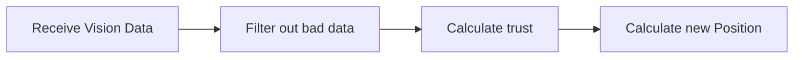
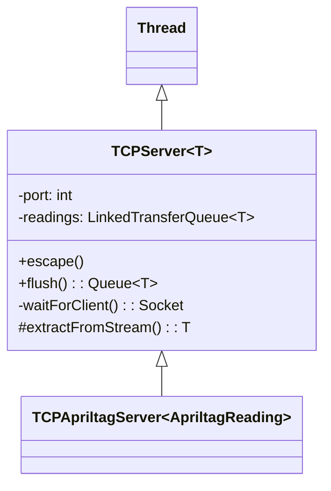

# Vision

This documentation is only for the **robot code** side of vision. Anything that relates to ROS or the raspberry PI will be documented somewhere else.

## Pose Estimation

Talk about a big topic.
!!! warning
    This code is a mess! When you put your clothes in the laundry they toss and tumble. You then have to untangle them before putting them in the drier. That is what this code code needs to be untangled and dried.

With that out of the way, Lets talk Pose estimation.



### Receiving Vision Data

Due to limitations in the throughput of network table traffic, we implemented a custom TCP protocol for relaying vision measurements from the raspberry PI to the roborio.

!!! note
    In hindsight, implementing a custom network protocol is a bit overkill and if anyone wants project to work on you can look into converting to using `Protobuf`.

#### TCP Socket



`TCPServer` extends `Thread`. This is because we want to still be able to run commands while we are reading vision measurements.

Let's Go through the logic of this class.

1. the server (rio) waits for a connection (from the pi) on a specific port. For the roborio you can use ports ranging from `5800-5810`
2. The data is then extracted from the stream to a queue of measurements called `readings`.
3. When ever the main thread wants to receive vision measurements, it can call `flush` to receive a queue containing the measurements since `flush` was last called.

!!! important
    `TCPServer` can be used for non-vision related tasks. Since it can read any type (that can be sent over a TCP socket) you can extend the class to take in a variety of data types.

We covered [step 1](#receiving-vision-data) above so Let's talk about filtering.

### Filtering Vision Measurements

One of the most important classes in our localization pipeline is called `PoseManager`, specifically its subclass `FilterablePoseManager`.

These classes do a lot but I have specifically chosen to separate the pipeline's documentation by *functionality* instead of class. In other words, this is not the last time you will hear about `PoseManager`.

Here are the relevant parts of `FilterablePoseManager`

``` java
public class FilterablePoseManager extends PoseManager {

    private final VisionFilter filter;
    
    public FilterablePoseManager(..., VisionFilter filter){
        this.filter = filter;
    }

    @Override
    public void processQueue() {
        LinkedHashMap<VisionMeasurement, FilterResult> filteredData =
        filter.filter(visionMeasurementQueue);
        ...
        for (Map.Entry<VisionMeasurement, FilterResult> entry : filteredData.entrySet()) {
            VisionMeasurement v = entry.getKey();
            FilterResult r = entry.getValue();
            switch (r) {
                case ACCEPTED -> {
                    ...
                }
                case NOT_PROCESSED -> {
                    ...
                }
                case REJECTED -> {
                    ...
                }
            }
        }
    }
}
```

what `processQueue` does is apply a filter to vision measurements and then manage them based on the result of the filter.

A `FilterResult` is an enum that (as indicated in the switch statement) can be either `ACCEPTED`, `NOT_PROCESSED`, or `REJECTED`.

A `VisionFilter` is an interface which takes in a `Queue` of `VisionMeasurment`s and returns a key-value pair mapping of each `VisionMeasurement` with a `FilterResult`

```java
public interface VisionFilter {
  LinkedHashMap<VisionMeasurement, FilterResult> filter(Queue<VisionMeasurement> measurements);
}
```

Currently, we have one `VisionFilter` called, `BasicVisionFilter`.

#### Basic Vision Filter

Here is the logic of the Filter

1. Take in two vision measurements and make sure they are not null
2. check the distance between the two measurements.
3. compare that distance to how much the wheel encoders told us we moved.
4. Check if the discrepancy between two two is less then some threshold.

This filter in effect requires two vision measurements to change in relatively the same manner as the wheels do.

### Calculate Trust

I told you we would be back to `FilterablePoseManager`.

Another parameter we take into the constructor of `FilterablePoseManager` is a `VisionTruster`. This object in in charge of calculating how much we should trust a vision measurement.

```java
public class FilterablePoseManager extends PoseManager {
    private final VisionTruster visionTruster;

    public FilterablePoseManager(...,VisionTruster truster){
        this.truster = truster;
    }

    @Override
    public void processQueue() {
        LinkedHashMap<VisionMeasurement, FilterResult> filteredData = filter.filter(visionMeasurementQueue);
        ...
        for (Map.Entry<VisionMeasurement, FilterResult> entry : filteredData.entrySet()) {
            VisionMeasurement v = entry.getKey();
            FilterResult r = entry.getValue();
            switch (r) {
                case ACCEPTED -> {
                    setVisionSTD(visionTruster.calculateTrust(v));
                }
                ...
            }
        }
    }
}
```

As you can see in the `ACCEPTED` case statement, we are setting called `setVisionSTD` and passing in the result of calculating how much we trust the measurement.

In the code we have a couple of `VisionTruster` classes:

- `ConstantVisionTruster` - does **not** change trust based on the measurement's distance to the apriltag.
- `LinearVisionTruster` - changes trust proportionally to the measurement's distance to the apriltag.
- `SquareVisionTruster` - changes trust proportionally to the measurement's distance to the apriltag **squared**

### Calculating Robot Position

Every tick the robot pose is updated with wheel odometry. Every tick we also process incoming vision measurements. If a measurement passes through all the filters it is added to the [SwerveDrivePoseEstimator](https://github.wpilib.org/allwpilib/docs/release/java/edu/wpi/first/math/estimator/SwerveDrivePoseEstimator.html) via `PoseManager#addVisionMeasurement(VisionMeasurment VisionMeasurment)`.
